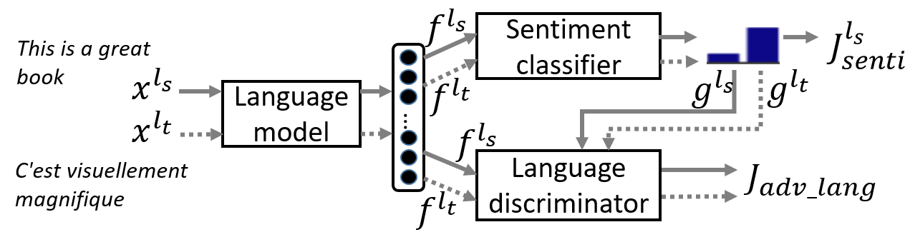

# CLAN: Conditional Language Adversaral Networks
This is the Pytorch implementation for our paper [Improving Cross-Lingual Sentiment Analysis via Conditional Language Adversarial Training of Neural Networks](http://). 
#### This work is accepted to the 3rd Workshop on Research in Computational Typology and Multilingual NLP (SIGTYP) at NAACL 2021.


### Abstract 
Sentiment analysis has come a long way for high-resource languages due to the availability of large annotated corpora. However, it still suffers from lack of training data for low-resource languages. To tackle this problem, we propose Conditional Language Adversarial Network (CLAN), an end-to-end neural architecture for cross-lingual sentiment analysis without cross-lingual supervision. CLAN differs from prior work in that it allows the adversarial training to be conditioned on both learned features and the sentiment prediction, to increase discriminativity for learned representation in the cross-lingual setting. Experimental results demonstrate that CLAN outperforms previous methods on the multilingual multi-domain Amazon review dataset.


## Python Requirements (Tested with follwoing versions)
- Pytorch v1.4.0
- PyYAML v5.3.1
- NumPy v1.15.2
- Mecab v0.996.3 (Japanese tokenization)
- NLTK v3.4.5 (English / French / German tokenization)


## Framework 
### CLAN 



# Dataset
### Download 

Download the Amazon review dataset:

```bash
git clone https://github.com/hemanthkandula/Conditional-Language-Adversaral-Networks.git
cd Conditional-Language-Adversaral-Networks
wget -P data/ http://www.uni-weimar.de/medien/webis/corpora/corpus-webis-cls-10/cls-acl10-unprocessed.tar.gz
tar xvf data/cls-acl10-unprocessed.tar.gz -C data/
```


Then run the following script to preprocess data:

```bash
python helper_utils/pre_process.py
```


### Run CLAN In-Domain settings:
Using all language data
```bash
#python train_dd_id_ccds.py --gpu_id 0 --sup_dom music --seed 0 ;\
```
Adapting specific languages data

```bash
#python train_clan_id.py --gpu_id 0 --source_lang en --target_lang ja --seed 0 ;\
```


### Run CLAN Cros-Domain settings:
```bash
python train_clan_cd.py --gpu_id 0 --source_lang en --target_lang de --source_domain dvd --target_domain music --seed 0
```


